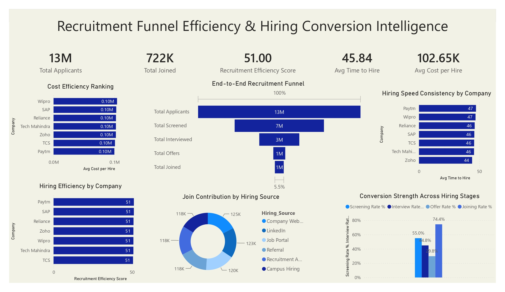

# 📊 Recruitment Funnel Efficiency & Hiring Conversion Intelligence

A comprehensive **Power BI Dashboard** that analyzes the end-to-end recruitment process, measuring hiring efficiency, conversion rates, recruitment costs, and hiring performance across organizations. This dashboard helps HR teams and recruiters optimize hiring strategies through data-driven insights.

---

## 📷 Dashboard Preview

---

# 📌 Project Overview

The **Recruitment Funnel Efficiency & Hiring Conversion Intelligence Dashboard** provides a complete view of the recruitment lifecycle—from application submission to employee onboarding. It enables HR professionals to evaluate recruitment efficiency, identify bottlenecks, compare hiring performance across companies, and improve hiring outcomes.

This dashboard is designed for:

- HR Managers
- Talent Acquisition Teams
- Recruiters
- Business Leaders
- Workforce Analysts
- Recruitment Consultants

---

# 🎯 Business Problem

Recruitment involves multiple stages, and organizations often struggle to identify where candidates drop out, how long hiring takes, and whether recruitment costs are justified.

This dashboard helps answer key questions such as:

- How efficient is the recruitment process?
- What percentage of applicants become employees?
- Which hiring sources contribute the most successful hires?
- Which companies hire the fastest?
- How much does each hire cost?
- Where do candidate drop-offs occur?

---

# 📂 Dataset

The dataset includes information such as:

- Applicant ID
- Company
- Hiring Source
- Recruitment Stage
- Screening Status
- Interview Status
- Offer Status
- Joining Status
- Time to Hire
- Cost per Hire
- Recruitment Efficiency Score

---

# 📈 Dashboard KPIs

| KPI | Value |
|------|--------|
| Total Applicants | 13M |
| Total Joined | 722K |
| Recruitment Efficiency Score | 51.00 |
| Average Time to Hire | 45.84 Days |
| Average Cost per Hire | 102.65K |

---

# 📊 Dashboard Features

## 1. End-to-End Recruitment Funnel

Visualizes the complete hiring pipeline:

- Total Applicants
- Total Screened
- Total Interviewed
- Total Offers
- Total Joined

**Purpose**

- Identify candidate drop-off rates across recruitment stages.
- Measure overall hiring conversion.

---

## 2. Cost Efficiency Ranking

Ranks companies based on **Average Cost per Hire**, including:

- Wipro
- SAP
- Reliance
- Tech Mahindra
- Zoho
- TCS
- Paytm

**Purpose**

- Compare recruitment spending across organizations.

---

## 3. Hiring Speed Consistency

Displays the **Average Time to Hire** by company.

**Purpose**

- Identify organizations with faster and more consistent recruitment processes.

---

## 4. Hiring Efficiency by Company

Compares recruitment efficiency scores across leading organizations.

**Purpose**

- Benchmark recruitment performance between companies.

---

## 5. Join Contribution by Hiring Source

Analyzes employee joins from different recruitment channels:

- Company Website
- LinkedIn
- Job Portal
- Referral
- Recruitment Agencies
- Campus Hiring

**Purpose**

- Determine the most effective hiring channels.

---

## 6. Conversion Strength Across Hiring Stages

Compares:

- Screening Rate
- Interview Rate
- Offer Rate
- Joining Rate

**Purpose**

- Evaluate recruitment funnel performance and identify optimization opportunities.

---

# 🛠 Tools Used

- Microsoft Power BI
- Power Query
- DAX
- Microsoft Excel
- Data Modeling

---

# 📌 Key Insights

- Over **13 million** applications were analyzed.
- Approximately **722,000** candidates successfully joined.
- The overall recruitment efficiency score is **51**, indicating room for process optimization.
- The average hiring process takes **45.84 days**.
- The average cost per hire is **102.65K**.
- Candidate drop-offs are highest between the screening and interview stages.
- Company websites and LinkedIn contribute significantly to successful hires.
- Leading organizations maintain relatively consistent hiring timelines.

---

# 💼 Business Value

This dashboard helps organizations:

- Improve recruitment efficiency.
- Reduce hiring costs.
- Shorten hiring cycles.
- Identify bottlenecks in the recruitment funnel.
- Optimize sourcing strategies.
- Increase candidate conversion rates.
- Support strategic workforce planning.

---

# 🚀 Future Enhancements

- Department-wise recruitment analysis
- Diversity hiring metrics
- Recruiter performance dashboard
- Candidate satisfaction analysis
- Predictive hiring success using Machine Learning
- Real-time ATS (Applicant Tracking System) integration

---

# 📚 Skills Demonstrated

- Data Cleaning
- Data Modeling
- Power Query
- DAX Measures
- KPI Development
- Recruitment Analytics
- HR Analytics
- Dashboard Design
- Business Intelligence
- Data Visualization

---

# 👨‍💻 Author

**Yashwanth Katuru**

Aspiring Data Analyst | Power BI Developer

### Technical Skills

- Power BI
- SQL
- Excel
- Python
- HR Analytics
- Data Visualization
- Dashboard Development
